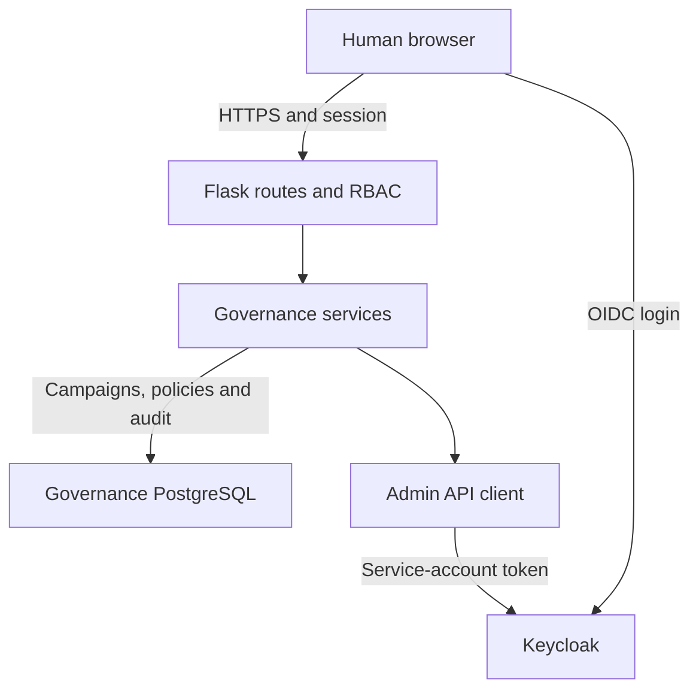

# IAM Governance Portal architecture

[Documentation index](../README.md#start-here) · [Governance behavior](../docs/governance-portal.md)

## Runtime boundaries

Human login uses `iam-admin-portal`; backend administration uses `iam-governance-service`. Audit actors remain the authenticated humans. The Governance database location comes from `DATABASE_URI`; the current Compose file does not provision it or fix its port to 5434.

## G11 transactions

Core campaign functions flush changes. The audited wrapper records the success event without committing, then commits both together. Errors roll back that transaction. Capture reads Keycloak direct role mappings but does not mutate Keycloak access.

The UI is implemented as Flask/Jinja routes. The presence of Flask-Smorest/OpenAPI scaffolding is not a full Governance REST API. See [access reviews](../docs/guides/g11-access-review-workflows.md) for state and ownership boundaries.
