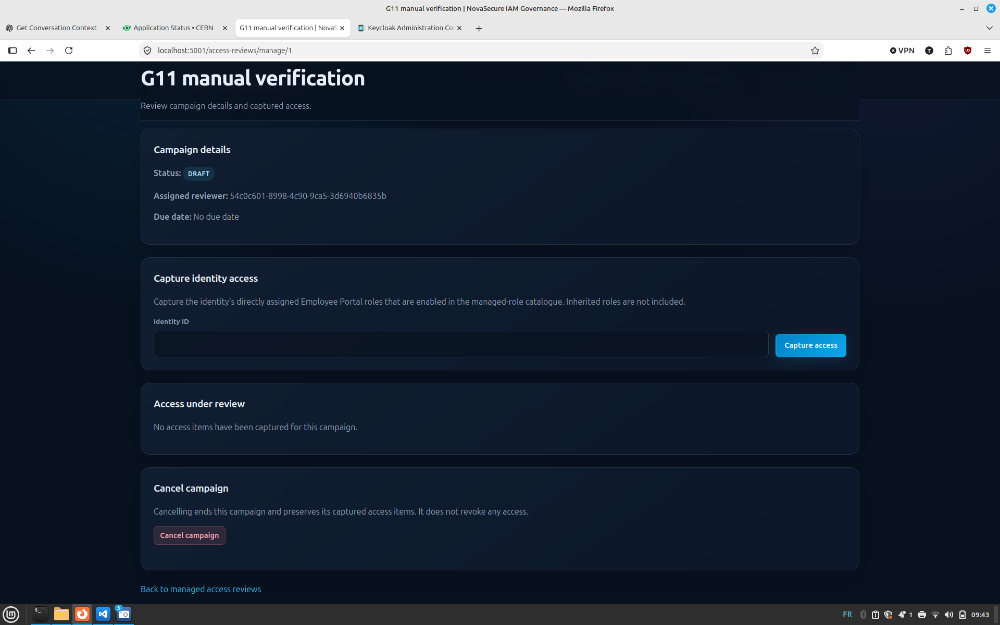
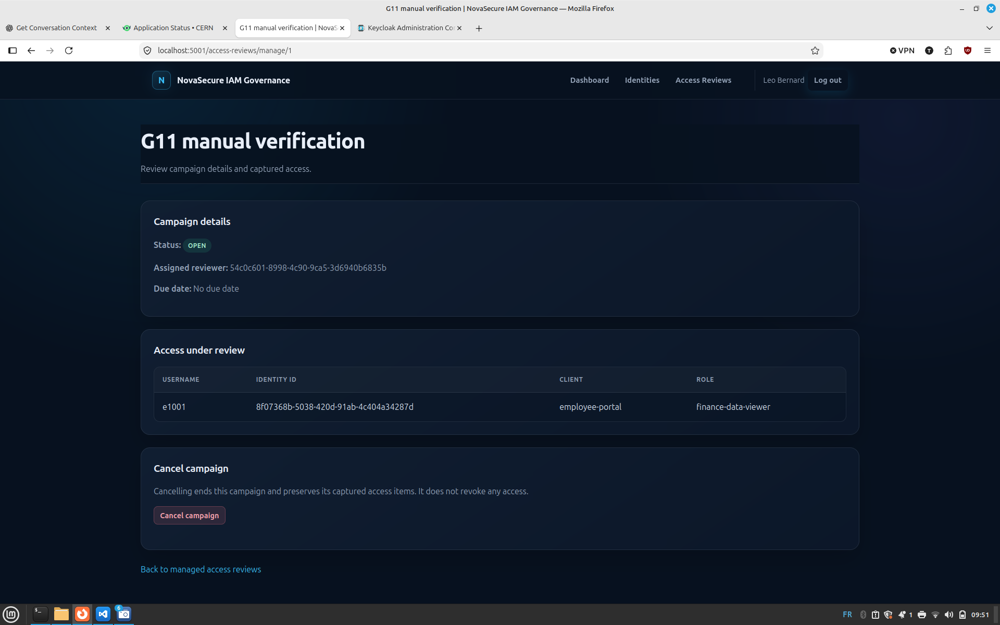
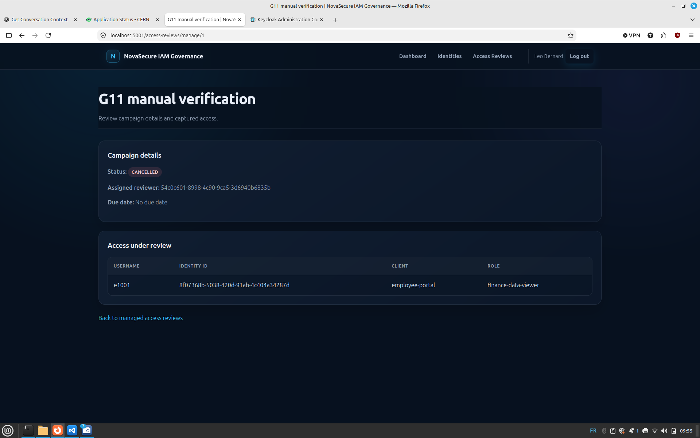
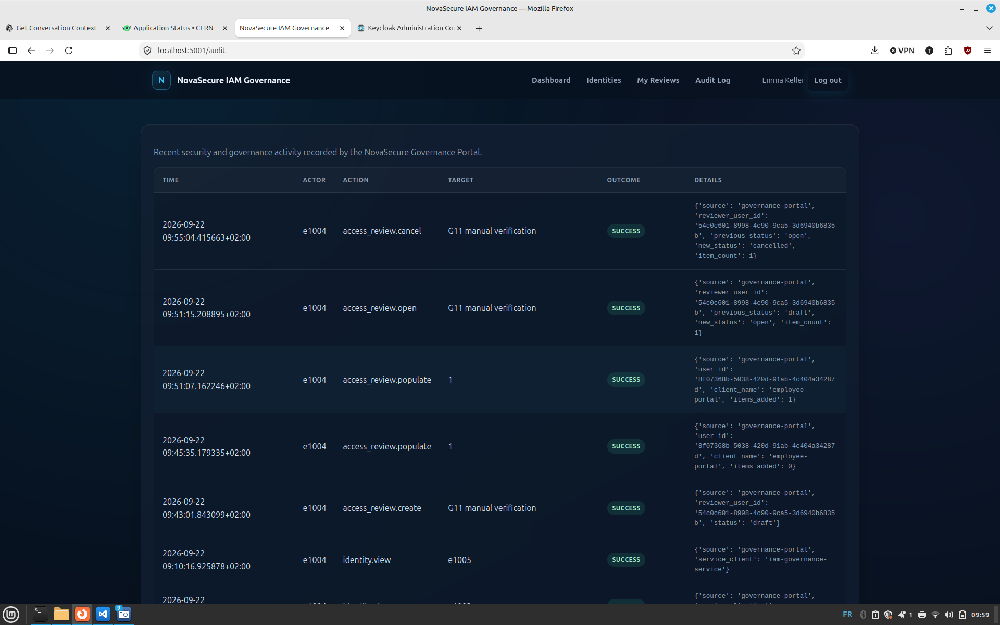

# G11 — Access review workflows

[Milestone index](README.md) · [Documentation index](../README.md)

## Purpose

Let a manager prepare an access review campaign, capture identity-role snapshots and assign a reviewer. Preserve the campaign and its audit evidence through opening and cancellation.

A snapshot records access selected for review at capture time. Capturing it does not grant or revoke the role, and subsequent Keycloak changes do not automatically update the snapshot.

## Implementation

`AccessReview` stores the campaign name, creator, assigned reviewer, status, timestamps and optional due date. `AccessReviewItem` stores the campaign reference, identity UUID, username, client, role UUID, role name and capture timestamp. A database uniqueness constraint prevents duplicate campaign/user/client/role combinations.

1. Create a draft after validating the inputs and reviewer eligibility. The reviewer must exist, be enabled and hold the effective `iam-admin-portal/access-reviewer` role.
2. Resolve the campaign through its authenticated manager before allowing a mutation.
3. Retrieve an identity's direct Employee Portal role mappings and retain roles enabled in the managed-role catalogue.
4. Skip existing snapshots and add eligible new items while the campaign remains in draft.
5. Open a nonempty draft to prevent further capture.
6. Allow cancellation from draft or open, preserving captured items.

## Permissions and lifecycle

Managers require `access-review-manager` and can manage only campaigns they created. Reviewers require `access-reviewer` and can read only campaigns assigned to their authenticated user UUID. These are client roles under `iam-admin-portal`. Missing and inaccessible campaigns receive the same not-found response.

| State | G11 behavior |
| --- | --- |
| `draft` | Capture access; open when nonempty; cancel |
| `open` | Read snapshots; cancel; no further capture |
| `cancelled` | Read preserved snapshots; no further mutations |
| `completed` | Model status reserved for the later certification workflow |

Reviewer lists include all assigned campaign statuses. Opening does not mark the first moment that a reviewer can see a campaign. Mutation routes use POST with CSRF protection and redirect to the manager detail page after success.

## Capture rules

The manager enters the identity's **Keycloak user UUID**, not an employee username such as `e1001`.

G11 retrieves **direct role mappings** for `employee-portal`. It retains only roles whose names occur in the enabled managed-role catalogue. It skips snapshots already present for the same campaign, user, client and role UUID; the database also enforces this uniqueness.

Group-inherited access and roles inherited through composites are not expanded into snapshots. A directly assigned composite role, if managed, is captured as that direct mapping, not as its expanded effective entitlements. An identity with only inherited roles can therefore produce a successful population event with `items_added: 0`.

Repeated capture adds newly eligible mappings but does not reconcile or delete old snapshots. This is a historical campaign record, not a live synchronization of all access.

**G12 will extend capture to inherited/effective access alongside certification decisions.** That work must preserve assignment provenance and distinguish removal of a direct mapping from remediation of a group or composite source. Removing a direct mapping alone may leave effective access intact.

## Routes

All routes require authentication. Mutating forms require CSRF tokens.

| Method and path | Permission and behavior |
| --- | --- |
| GET `/access-reviews` | Reviewer: list assigned campaigns |
| GET `/access-reviews/<review_id>` | Reviewer: read assigned campaign and items |
| GET/POST `/access-reviews/new` | Manager: creation form / validated audited creation |
| GET `/access-reviews/manage` | Manager: list owned campaigns |
| GET `/access-reviews/manage/<review_id>` | Manager: inspect owned campaign |
| POST `/access-reviews/manage/<review_id>/populate` | Manager: capture direct managed access in owned draft |
| POST `/access-reviews/manage/<review_id>/open` | Manager: open owned nonempty draft |
| POST `/access-reviews/manage/<review_id>/cancel` | Manager: cancel owned draft or open campaign |

Successful mutations redirect with HTTP 303 to the manager detail page. Wrong roles return 403; missing or inaccessible campaigns return 404; incompatible campaign states return 409. Invalid form data returns 400. Caught Keycloak API lookup failures return 503. Caught persistence failures return 500 during creation and 503 during population/opening/cancellation.

The creation form interprets its optional date/time as UTC. The service accepts timezone-aware `datetime` values; no automatic deadline enforcement is implemented.

## Transactions and audit

Core campaign functions add or update objects and **flush without committing**. Audited wrappers validate ownership/eligibility, perform the operation, call `record_audit_event(commit=False)` and commit once. On failure they roll back and re-raise, preventing a successful campaign change without its corresponding success audit record.

| Action | Recorded details |
| --- | --- |
| `access_review.create` | Reviewer UUID, initial status, source |
| `access_review.populate` | Captured identity UUID, client, `items_added`, source |
| `access_review.open` | Reviewer UUID, `previous_status`, `new_status`, `item_count`, source |
| `access_review.cancel` | Reviewer UUID, actual previous status, `new_status`, preserved item count, source |

Each event records the human actor ID/username and the campaign target ID. Creation/open/cancel also include the campaign name. Population currently displays the campaign ID as its target in the audit viewer. Selected route denials and failures are application logs, not the success records above.

## Verify the milestone

Automated coverage checks input validation, ownership, reviewer eligibility, capture filtering, duplicate suppression, state transitions, snapshot preservation, transaction rollback, route permissions and CSRF protection. Keycloak calls are mocked in automated tests.

## Manual verification — 2026-09-22

Campaign: **G11 manual verification**, ID `1`. Manager: **Leo (`e1004`)**. Reviewer: **Emma (`e1005`)**. Captured identity: **Alice (`e1001`)**, role `employee-portal/finance-data-viewer`.

| Step | Observed result |
| --- | --- |
| Create campaign | Draft created and assigned to Emma after eligibility configuration was corrected |
| Capture inherited-only access | No items added; population audit recorded `items_added: 0` |
| Add a temporary direct mapping and capture again | One finance-role snapshot created; audit recorded `items_added: 1` |
| Open | Status changed from draft to open; capture form disappeared |
| Sign in as Emma | Assigned reviewer view confirmed working by the operator |
| Cancel as Leo | Status changed from open to cancelled; snapshot remained; mutation controls disappeared |
| Inspect `/audit` as Emma | Create, both populate attempts, open and cancel recorded with actor `e1004` and success outcomes |

### Draft campaign

Leo created the campaign and assigned Emma as its reviewer. The campaign is in draft and has no captured items yet.



### Open campaign

Alice's directly assigned Finance role appears in the captured access table. The campaign is open and the capture form is no longer available.



### Cancelled campaign

Cancellation preserves the captured role snapshot. The status is cancelled and the capture, open and cancel controls are absent.



### Audit trail

The audit viewer shows creation, both population attempts, opening and cancellation. Leo (`e1004`) is recorded as the actor; the attempts added zero and one item respectively.



### Evidence limits

The zero-item attempt happened **before** the direct assignment; it is not manual evidence of duplicate suppression. Duplicate suppression is covered by automated tests. The campaign screenshot proves snapshot retention, not the live Keycloak assignment after cancellation; check that mapping separately when repeating the walkthrough. Reviewer behavior was reported by the operator, without a reviewer-detail screenshot in this evidence set.

The temporary Finance mapping was a test fixture, not Alice's baseline HR entitlement. After verifying live access preservation, remove only that temporary direct mapping. Direct changes through the Keycloak console bypass the portal's SoD enforcement and must not be interpreted as policy-approved grants.

## Troubleshooting

### Reviewer lookup reports Client not found

During this walkthrough the console administrator could see `iam-admin-portal`, but the service-account client query could not. Add the service-policy View permission scoped specifically to `iam-admin-portal`; see [service-account configuration](../governance-portal.md#service-account-configuration-used-in-the-lab). Do not broaden to All Clients merely to make the lookup succeed.

### reviewer_missing_required_role

Use the exact `iam-admin-portal/access-reviewer` role. The lab had `acces-reviewer`, missing an `s`; the corrected role and mapping resolved the rejection. A realm role called `iam-auditor` is not itself the client role checked by the validator.

### Capture succeeds but the table is empty

Check direct role mappings, the target client, enabled catalogue entries and existing snapshots. Inherited-only access is excluded in G11. A success outcome means the capture operation completed, not that it necessarily added an item.

## Boundaries

G11 provides preparation, viewing, opening and cancellation. Certification decisions, automated revocations, completion, deadline enforcement and reminders remain unimplemented.

Reviewer eligibility is checked at creation; there is no periodic eligibility revalidation job. Self-certification prevention and enforcement of conflicting Governance roles are not implemented.

G12 is planned to add certification decisions and inherited/effective-access capture. Assignment provenance must distinguish direct mappings from group or composite sources: removing a direct mapping alone may leave effective access intact.

## Implementation references

- [models/access_review.py](https://github.com/Thomas170491/enterprise-iam-lab/blob/b6072773931b2b593a7264c375fd6ab1035686fa/apps/governance-portal/models/access_review.py)
- [models/access_review_item.py](https://github.com/Thomas170491/enterprise-iam-lab/blob/b6072773931b2b593a7264c375fd6ab1035686fa/apps/governance-portal/models/access_review_item.py)
- [services/access_review_service.py](https://github.com/Thomas170491/enterprise-iam-lab/blob/b6072773931b2b593a7264c375fd6ab1035686fa/apps/governance-portal/services/access_review_service.py)
- [governance/routes.py](https://github.com/Thomas170491/enterprise-iam-lab/blob/b6072773931b2b593a7264c375fd6ab1035686fa/apps/governance-portal/governance/routes.py)

## Focused tests

Run from `apps/governance-portal` with its virtual environment active:

```bash
python -m pytest -q tests/test_access_review_service.py tests/test_access_review_audit.py tests/test_access_review_routes.py
```

These commands cover the service, audit wrappers and routes. They were not executed during this documentation update. The source references above are pinned to the same reviewed commit as the G1–G10 guides.

## Further reading

- [Governance Portal](../governance-portal.md)
- [Testing](../testing.md)

Previous: [G10 — Segregation of Duties](g10-segregation-of-duties.md) · Next: [G12 — Certification decisions (planned)](../roadmap.md)
